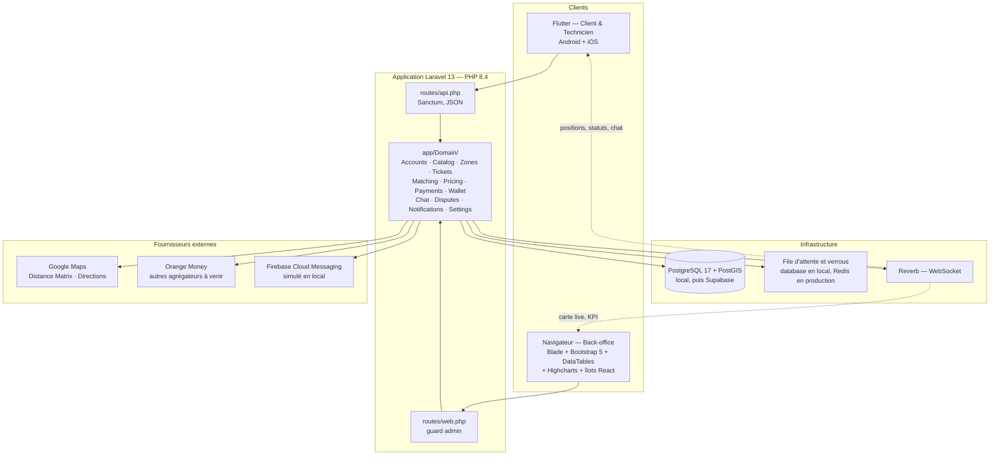
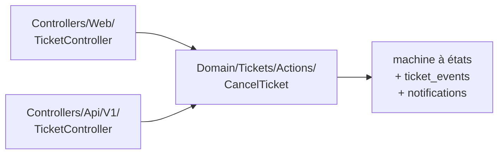
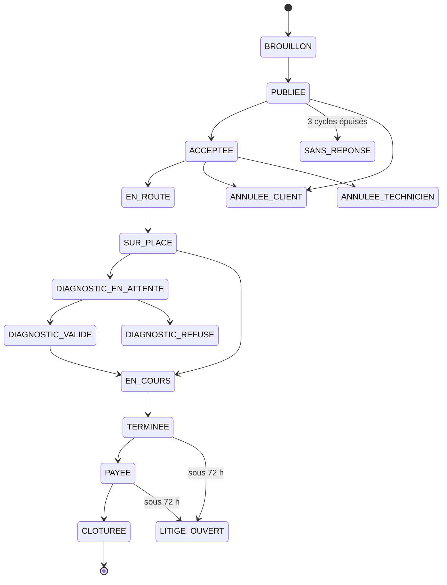

# Architecture

## Vue d'ensemble

Une seule application Laravel sert **à la fois** le back-office web et l'API
mobile : un seul ORM, un seul jeu de migrations, une seule logique métier, un
seul déploiement.

## Règle structurante

La logique métier vit dans des classes d'action et de service sous
`app/Domain/<Contexte>/`. Les contrôleurs web et les contrôleurs API sont de
simples adaptateurs qui appellent **les mêmes actions**.

C'est ce qui rend cohérent l'ordre d'exécution du projet : le bloc B
(back-office) construit les actions du domaine, le bloc C (API mobile) les
réutilise telles quelles.

## Cycle de vie d'un ticket

Le modèle de données détaillé et son diagramme entité-relation seront produits
en **phase A1**, dans `docs/data-model.md`.
