# Modèle de données

28 migrations, dont 22 propres au produit. PostgreSQL 15+ avec PostGIS, en local
comme sur Supabase.

## Principes

- **Tous les montants sont des entiers de GNF**, en `bigInteger`, suffixés `_gnf`
  (ADR-0002). Aucun flottant ne touche l'argent. Un test du schéma vérifie que
  toute colonne `%_gnf` est bien un `bigint`.
- **Les positions sont des `GEOGRAPHY(…, 4326)`**, jamais des paires de colonnes
  `lat`/`lng` : c'est ce qui permet `ST_DWithin` et les index GiST.
- **Les instantanés priment sur les références** là où l'historique doit
  survivre : le ticket recopie l'adresse (`address_snapshot`) et le prix de la
  prestation, pour qu'une suppression d'adresse ou un changement de tarif ne
  réécrive pas le passé.
- **La comptabilité est en mouvements** : `transactions` est la seule source de
  vérité du solde (ADR-0004).

## Diagramme entité-relation

```mermaid
erDiagram
    users ||--o| client_profiles : "profil client"
    users ||--o| technician_profiles : "profil technicien"
    users ||--o{ addresses : "enregistre"
    users ||--o{ refresh_tokens : "session mobile"
    users ||--o{ tickets : "demande"
    users ||--o{ transactions : "portefeuille"
    users ||--o{ withdrawals : "retire"

    client_profiles }o--o| addresses : "adresse par défaut"

    service_categories ||--o{ services : "regroupe"
    services ||--o{ tickets : "prestation"
    zones ||--o{ tickets : "zone et tarif"
    addresses ||--o{ tickets : "lieu"

    tickets ||--o{ ticket_events : "journal des états"
    tickets ||--o{ match_attempts : "sollicitations"
    tickets ||--o{ messages : "chat"
    tickets ||--o{ payments : "paiement"
    tickets ||--o{ transactions : "mouvements"
    tickets ||--o| reviews : "évaluation"
    tickets ||--o{ disputes : "litiges"
    disputes ||--o{ dispute_messages : "messagerie support"

    admin_users ||--o{ withdrawals : "traite"
    admin_users ||--o{ disputes : "résout"

    users {
        bigint id PK
        string phone UK "E.164, identifiant de connexion"
        string password "argon2id"
        string full_name
        string email "facultatif"
        bool is_client
        bool is_technician
        string status "ACTIF | SUSPENDU"
        timestamp last_login_at
    }

    technician_profiles {
        bigint user_id PK,FK
        jsonb specialties "PLOMBERIE, ELECTRICITE"
        string verification_status "EN_ATTENTE_VALIDATION | VALIDE | REJETE | SUSPENDU"
        string id_doc_front_url "bucket privé"
        string id_doc_back_url "bucket privé"
        string selfie_url "bucket privé"
        geography service_area "POLYGON 4326"
        geography base_location "POINT 4326"
        geography last_known_location "POINT 4326"
        bool is_online
        decimal rating_avg
        int jobs_completed
        decimal acceptance_rate
        decimal cancellation_rate
    }

    client_profiles {
        bigint user_id PK,FK
        int loyalty_points
        bigint default_address_id FK
        int tickets_count
    }

    addresses {
        bigint id PK
        bigint user_id FK
        string label "Domicile, Bureau"
        string formatted_address
        string landmark "près de la mosquée de Kipé"
        geography location "POINT 4326"
        bool is_default
    }

    service_categories {
        bigint id PK
        string code UK "PLOMBERIE | ELECTRICITE"
        string name
        string icon
        string color
        bool is_active
    }

    services {
        bigint id PK
        bigint category_id FK
        string slug UK
        string name
        jsonb included "ce que couvre le prix fixe"
        jsonb excluded "ce qu'il ne couvre pas"
        bigint base_price_gnf
        int estimated_duration_min
        bool is_active
    }

    zones {
        bigint id PK
        string code UK
        string name
        geography boundary "POLYGON 4326"
        bigint base_travel_fee_gnf
        bigint price_per_km_gnf
        int included_km
        bool is_active
    }

    tickets {
        bigint id PK
        string reference UK "DM-2026-000123"
        bigint client_id FK
        bigint technician_id FK
        bigint service_id FK
        bigint zone_id FK
        string state "machine à états §8.1"
        jsonb address_snapshot "copie figée"
        geography location "POINT 4326"
        decimal distance_km
        bool distance_is_estimated "repli Haversine"
        bigint base_price_gnf
        bigint travel_fee_gnf
        bigint extra_fee_gnf
        bigint total_gnf
        bigint commission_gnf
        bigint technician_net_gnf
        decimal commission_rate "taux figé au paiement"
    }

    ticket_events {
        bigint id PK
        bigint ticket_id FK
        string from_state
        string to_state
        string actor_type "CLIENT | TECHNICIEN | ADMIN | SYSTEME"
        bigint actor_id
        jsonb metadata
    }

    match_attempts {
        bigint id PK
        bigint ticket_id FK
        bigint technician_id FK
        int cycle "1 à 3"
        int radius_km "5, 10 puis 15"
        int position "rang dans le cycle"
        decimal score
        jsonb score_breakdown
        decimal distance_km
        string response "EN_ATTENTE | ACCEPTE | REFUSE | EXPIRE | ANNULE"
        timestamp notified_at
        timestamp expires_at
    }

    messages {
        bigint id PK
        bigint ticket_id FK
        bigint sender_id FK
        text content "après masquage"
        text original_content "réservé au support"
        bool is_flagged
        string flag_reason "TELEPHONE | EMAIL | LIEN"
    }

    payments {
        bigint id PK
        bigint ticket_id FK
        string provider
        string provider_ref UK "clé d'idempotence du webhook"
        string method "ORANGE_MONEY | MTN_MOMO"
        bigint amount_gnf
        string status "EN_ATTENTE | CAPTUREE | LIBEREE | ECHOUEE | REMBOURSEE"
        timestamp captured_at
        timestamp released_at
        timestamp auto_release_at "séquestre 24 h"
    }

    transactions {
        bigint id PK
        bigint user_id FK
        bigint ticket_id FK
        string type "EARNING | COMMISSION | WITHDRAWAL | REFUND | ADJUSTMENT | TIP"
        bigint amount_gnf "signé"
        bigint balance_after_gnf "recalculé, jamais incrémenté"
        string description
    }

    withdrawals {
        bigint id PK
        string reference UK
        bigint technician_id FK
        bigint amount_gnf
        string mobile_money_number
        string status "EN_ATTENTE | APPROUVE | PAYE | REJETE"
        bigint processed_by FK
    }

    reviews {
        bigint id PK
        bigint ticket_id FK,UK
        bigint client_id FK
        bigint technician_id FK
        int rating "1 à 5"
        jsonb tags
        text comment
        bigint tip_gnf
    }

    disputes {
        bigint id PK
        string reference UK
        bigint ticket_id FK
        bigint opened_by FK
        string reason
        string status "OUVERT | EN_COURS | RESOLU | REJETE"
        string priority "BASSE | NORMALE | HAUTE | URGENTE"
        timestamp sla_due_at
        string resolution
        bigint refund_gnf
        bigint resolved_by FK
    }
```



## Tables techniques

| Table | Origine |
|---|---|
| `dispute_messages` | messagerie interne du support sur un litige (§6) — distincte du chat client ↔ technicien |
| `password_reset_codes` | code SMS à 6 chiffres, hashé, 10 min — réservé aux comptes de l'application |
| `password_reset_tokens` | mécanisme Laravel standard — réservé aux comptes du back-office |
| `admin_users` | comptes du back-office, guard séparé |
| `app_settings` | paramètres pilotables : commission, matching, séquestre, litiges |
| `sessions`, `cache`, `cache_locks`, `jobs`, `failed_jobs`, `job_batches` | Laravel |
| `personal_access_tokens` | Sanctum |
| `roles`, `permissions`, `model_has_roles`, … | spatie/laravel-permission |
| `activity_log` | spatie/laravel-activitylog — journal d'audit |
| `notifications` | notifications Laravel |

## Index

**GiST**, obligatoires sur toutes les colonnes géographiques :

```
addresses_location_gist
tickets_location_gist
zones_boundary_gist
technician_profiles_base_location_gist
technician_profiles_last_known_location_gist
technician_profiles_service_area_gist
```

**Composites**, imposés au §9 :

```
tickets(state, created_at)                          -- DataTables et graphiques
technician_profiles(is_online, verification_status) -- filtre de tête du matching
```

Plus, ajoutés là où le produit lira souvent : `tickets(client_id, created_at)`,
`tickets(technician_id, created_at)`, `messages(ticket_id, created_at)`,
`messages(is_flagged, created_at)`, `payments(status, auto_release_at)`,
`transactions(user_id, created_at)`, `disputes(status, priority, created_at)`.

## Jeu de démonstration

`php artisan migrate:fresh --database=pgsql_migrations --seed` produit :

| | |
|---|---|
| Catégories et prestations | 2 et 20, à prix fixes réalistes |
| Zones | 3 emprises de Ratoma, grilles tarifaires distinctes |
| Techniciens | 40 — dont 34 validés, 4 en attente, 2 rejetés, ~22 en ligne |
| Clients | 20, avec adresses et repères textuels |
| Tickets | 150 sur 90 jours, dans 13 états différents |
| Autour des tickets | ~960 événements, ~385 sollicitations, ~640 messages (dont une cinquantaine signalés), 100 paiements, ~170 mouvements, ~60 avis, 5 litiges, 8 retraits |
| Back-office | 3 comptes — ADMIN, SUPPORT, FINANCE — et 22 permissions |

Le jeu est **cohérent, pas seulement volumineux** : le total de chaque ticket est
la somme exacte de ses composantes, la commission et le net technicien retombent
au franc près sur le total, chaque `balance_after_gnf` suit la somme des
mouvements du technicien, et la note affichée sur un profil correspond à la
moyenne de ses avis. Ces quatre propriétés sont vérifiées par
`tests/Feature/DemoDataTest.php`.
